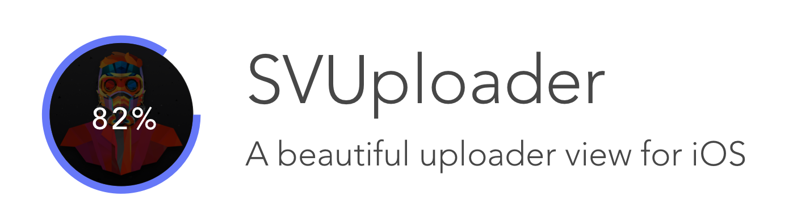

 

# SVUploader 


A view class for iOS that makes uploading easy and beautiful.

## Demo

SVUploader is fully customizable - check out 2 demos.


## Installation

Just drag the SVUploader.swift file to your project, and you'll be all set to go.

## Guide

SVUploader takes care of the visual part of the upload part of process for you; all you have to do is instantiate an SVUploader, place it on the screen, and give it the progress of your upload. It's that simple! Let's go ahead and start with an example.


### Use it! (Quick and Simple)

Now, if you just want to use it straight out of the box, it's extremely simple.

```swift
// Create the uploader view
let uploaderView = SVUploader(frame: uploaderFrame)

// Set the image you want to upload
uploaderView.image = imageThatIWantToUpload

// Start the upload
uploaderView.startUpload()

// Update the progress in your update code
uploaderView.progress = newProgress

// End the upload, and specify whether it succeeded or failed
self.uploaderView.endUpload(success: true)
```
SVUploader will automatically present the appropriate view depending on whether or not there was an error.

The following are about the more detailed parts of SVUploader that you can customize to create a unique experience.


### Properties

SVUploader has several properties that you can change. The default values are specified, and they're set to one variation of what I think looks nice. Some of these variables can only be set using the initializers and cannot be changed later, so check out that section next.

`isUploading (read-only)` - Whether or not the UI is currently uploading. This is internally managed and should only be read by the user.

`progressAnimationSpeed (2)` - The speed of the circular animation between progress value changes. This number should be changed depending on the length of intervals between each progress percentage update (the time it takes to receive an update on how much of the upload has been finished). For larger intervals, a lower speed is recommended for a smoother animation. For shorter intervals, a higher speed is recommended to prevent slow animation and lag. This default value of 2 should work fine for most default intervals.

`useSmoothAnimation (true) (initializer-only)` - iOS automatically animates the path changes to make things look smooth. You can disable this effect, although it would probably just make it looks worse (but hey, I don't judge).

`useBlur (false) (initializer-only)` - Whether the overlay uses a blur effect or a dark overlay effect. Can only be set using the initializer.

`useShadow (false) (initializer-only)` - Whether the uploader uses the shadow effect. Can only be set using the initializer.

`lineColor (dark purple)` - The color of the circular loader.

`lineWidth (12)` - The line width of the circular loader.

`borderColor (dark gray)` - The border color.

`borderWidth (0)` - The border width.

`overlayOpacity (0.6)` - The opacity of the dark overlay effect (only applicable if `useBlur` is false).

`mainFont (Avenir-Medium Size 30)` - The font of the percentage text in the uploader.

`messageDuration (2 seconds)` - The duration of the message to be displayed at the end of the upload.

`successImage (Green check)` - The image to present when an upload is successful.

`errorImage (Red X)` - The image to present when an upload has failed.

`progress` - The progress percentage of the upload. Update this variable with a decimal to update the uploader.


### Initializers

There are several different initializers for different needs. Not all properties can be set using an initializer, so be sure to check them above and change any if needed after initializing a view. Use the last one if you want to change variables that can only be set with the initializer.

`init(frame: CGRect)` - The standard initalizer. It sets everything up but you can still change some properties later.

`init(lineColor: UIColor, lineWidth: CGFloat)` - The most commonly used one. You can customize the most important part of the loader - the circular loader.

`init(lineColor: UIColor, lineWidth: CGFloat, borderColor: UIColor, borderWidth: CGFloat` - A little fancier. You can now add in a border as well.

`init(useBlur: Bool, useShadow: Bool, useSmoothAnimation: Bool)` - The initializer only variables can be set here. To keep it short, I've only included those, but you can still change the rest of the properties later.

### Use it! (Advanced Customization)

Now, let's take a look at how to customize this experience. SVUploader is extremely modular; take a look at its view structure. The following views can be swapped out with your own for a custom look - just set the property equal to your own custom view.

Here's a hierarchy view of SVUploader.

 

`contentView` - The "content" or image of the uploader view. If you want more than just a thumbnail picture to show up, you can customize it by replacing it with your own view.

`overlayView` - The view that overlays the `contentView`. By default, it is a dark overlay or blur.

`loadingLabel` - The text that describes the progress of the upload. By default, it displays the percentage, but you can edit its text or create your own new label.

`endView` - The view that shows up after the upload has finished. By default, it shows an error/success image.

If you don't want to create a brand new view from scratch, and just want to modify some of the details such as the blur effect or image size, you can take a look at all of the views the class uses by reading the source code.

## Coming Soon

SVUploader still has a lot more potential with more customizability and cooler features, such as:

- Specify a text message (not just image) after the upload
- Pick from several different animation options
- Anything else you can think of. Feel free to open an issue for a feature request, or contribute to the project!


## Contribute
Feel free to to contribute to the project with any features you think would be cool or bug fixes. You can also help by simply opening up an issue if you find a bug or would like a new feature to be added. I'll try my best to continue and update the project.